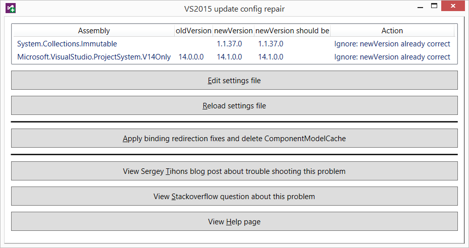

RepairVS2015Update
==================

Update: This utility is obsolete!
---------------------------------
The *"The 'package name' package did not load correctly"* problem has been solved
by MS. Ironically, it seems it was already solved before I uploaded this utility
on GitHub. Nevertheless, I'm leaving the repo here as an example of a quick&dirty
WPF program written entirely in F# with no XAML at all.

What it does
------------

After applying updates, Visual Studio 2015 sometimes (or, in the case of my 
machine, always) shows *"The 'package name' package did not load correctly"* 
error messages.

RepairVS2015Update attempts to solve the problem, by deleting the 
CompontenModelCache directory and fixing faulty binding redirect entries
in the "C:\Users\user\AppData\Local\\Microsoft\VisualStudio\14.0\devenv.exe.config"
file, as suggested in the answers to 
<a href="http://stackoverflow.com/questions/31547947/packages-not-loading-after-installing-visual-studio-2015-rtm">
this Stackoverflow question</a> and on
<a href="https://sergeytihon.wordpress.com/2015/12/01/how-to-restore-viual-studio-2015-after-update-1-dependency-dance">
Sergey Tihon's blog.</a>

How to use it
-------------

The "Edit settings file" button does exactly what it says on the tin. This is
a sample settings file (it also happens to be the default one):

	{
	  "Redirections": [
		{
		  "AssemblyName": "System.Collections.Immutable"
		},
		{
		  "AssemblyName": "Microsoft.VisualStudio.ProjectSystem.V14Only",
		  "OldVersion": "14.0.0.0"
		}
	  ]
	}

The first "Redirections" entry causes RepairVS2015Update to *update* the existing 
System.Collections.Immutable binding redirection in devenv.exe.config, so that 
it matches the actual version of that assembly.

The second entry has an "oldVersion" property specified. This causes 
RepairVS2015Update to *add* a new binding redirection in devenv.exe.config,
if it wasn't present before. Otherwise, it updates it.

*Reload* the settings file after editing it.

All buttons should be self explanatory.

Why I wrote it
--------------

The VS2015 updates have an annoying habit of resetting the Collections.Immutable 
binding redirect version to the incorrect value "1.1.36.0" every single time 
something is updated. I had enough of editing  "devenv.exe.config" and 
navigating to and deleting the CompontenModelCache directory again and again, 
so I wrote this utility to automate it.

Future development
------------------

None whatsoever. Hopefully, the bugs corrupting devenv.exe.config will be fixed
soon, and this utility won't be needed for much longer. But until then, it's
useful at least for me.
